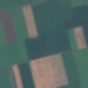
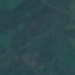
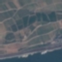
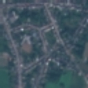
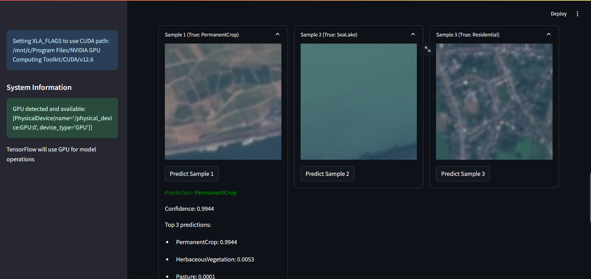

# Satellite Image Classification

## 1. Methodology
```
Data Collection → Data Pre-Processing → Model Training → Model Testing → Result Analysis
```

## 2. Description
* Dataset = EuroSAT RGB Satellite Imagery
* Best Model = MobileNetV2 Transfer Learning
* Best Accuracy = 94%
* Other information:
  * Advanced satellite image classification system using TensorFlow
  * Transfer learning with MobileNetV2 and custom CNN options
  * GPU-accelerated processing with CUDA/cuDNN optimization
  * Homomorphic encryption demonstration using TenSEAL
  * Interactive web interface built with Streamlit

## 3. Input / Output
| Test Image | Actual | Predicted | Result |
|------------|--------|-----------|--------|
|  | AnnualCrop | AnnualCrop | ✓ |
|  | Pasture | Pasture | ✓ |
|  | PermanentCrop | PermanentCrop | ✓ |
|  | Residential | Residential | ✓ |
|  | SeaLake | Forest | ✗ |

## 4. Live Link
Link: www.SatelliteImageClassifier.com

## 5. Screenshot of the Interface


## Installation Requirements
```bash
# Install dependencies
pip install -r requirements.txt
```

## Usage
```bash
# Train the model
python advanced_model.py

# Launch the web interface
streamlit run streamlit_app.py
```